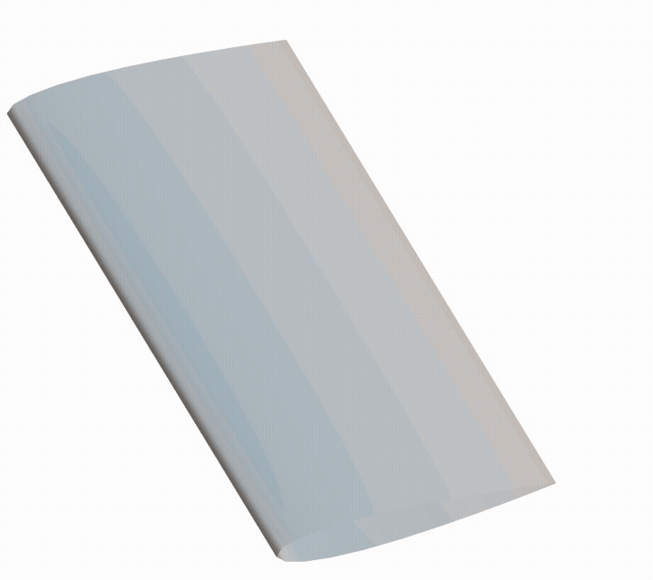
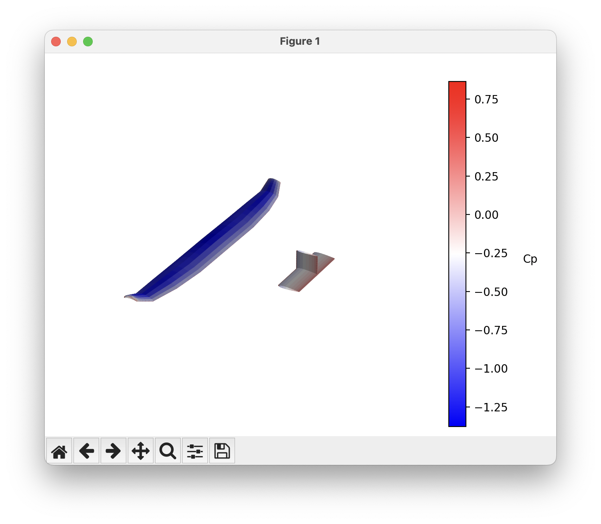

# AVL + python + optimization = OptVL
<!--  -->


<!-- [](https://pepy.tech/project/optvl) -->
[Documentation](https://joanibal.github.io/OptVL/)
[OptVL for AVL users](https://joanibal.github.io/OptVL/optvl_api)

OptVL is a modified version of Mark Drela and Harold Youngren's famous AVL code with a python-wrapper and AD derivative routines for gradient-based optimization.
Its key features are
- Python wrapper to easily conduct large parameter sweeps from an existing AVL geometry file or include a vortex lattice method in a larger model.
- Total derivatives of total forces, control surface derivatives, and stability derivatives with respect to geometric and aerodynamic variables for use with gradient-based optimization.
- Post-processing directly through Python or Paraview and Tecplot for flexibility. 

# Installation
The best way to install OptVL is through pip
```
pip install optvl
```
Windows, macOS, and Linux are all supported!
For information on building locally see the [developer docs](https://joanibal.github.io/OptVL/building_optvl_locally/)

# Basic usage
The API of OptVL was made to mirror the usage of AVL through its text interface. 
The user loads in a geometry file, adds constraints, and then executes analysis runs.

The AVL wrapper is implemented in the `OVLSolver` class. 
To use this wrapper, first one must initialize the `OVLSolver` object with a geometry file and optionally a mass file. 
After, the user can add constraints and then execute the run to generate data. 
Below is a basic example of this workflow and [this page](https://joanibal.github.io/OptVL/making_a_script/) provides more information on building run scripts. 

```python
from optvl import OVLSolver

ovl = OVLSolver(geo_file="../geom_files/aircraft.avl", debug=True)

# look at the geometry to see that everything is right
ovl.plot_geom()

# set the angle of attack
ovl.set_variable("alpha", 1.23)
# modify the mach number
ovl.set_parameter("Mach", 0.3)

# set the deflection of the elevator to trim the pitching moment
ovl.set_constraint("Elevator", "Cm", 0.00)

ovl.set_control_deflection("Elevator", 10.0)

# This is the method that acutally runs the analysis
ovl.execute_run()

# print data about the run
force_data = ovl.get_total_forces()
print(
    f'CL:{force_data["CL"]:10.6f}   CD:{force_data["CD"]:10.6f}   Cm:{force_data["Cm"]:10.6f}'
)

# lets look at the cp countours
ovl.plot_cp()
```
The plotting calls in this example use matplotlib to produce visualizations like this 


# Examples
- [Eigen value analysis](https://joanibal.github.io/OptVL/modal_analysis/)
- [Modify leading edge position](https://joanibal.github.io/OptVL/parameter_sweeps/)
- [Twist optimization with Scipy](https://joanibal.github.io/OptVL/optimization_setup_scipy/)
- [Twist optimization with OpenMDAO](https://joanibal.github.io/OptVL/optimization_setup_om/)
- [Planform optimization with OpenMDAO](https://joanibal.github.io/OptVL/planform_optimization/)

# License

As stated, OptVL includes a modified version of the source code of AVL.
AVL is distributed under the GLP version 2 license.
As a consequence, OptVL is also distributed under a GLP license via the copyleft principle of the original license. 
Although, here we update the GLP license to version 3 as allowed by the original license. 

This software includes portions of [NetLib's LAPACK library](https://www.netlib.org/lapack/). LAPACK is a software package provided by University of Tennessee, University of California Berkeley, University of Colorado Denver and NAG Ltd under the modified BSD license.  See the license file in src/lapack/LICENSE.txt for more details.
