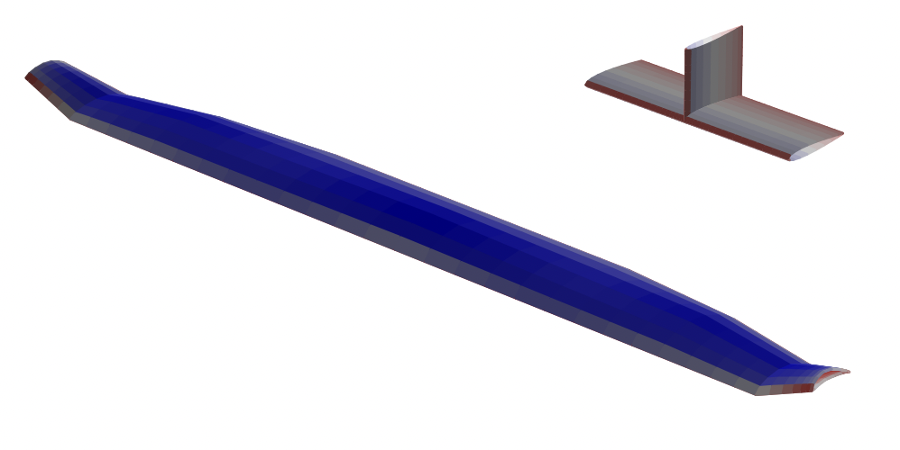

# OptVL Documentation

Welcome to the official documentation for OptVL!
OptVL builds on Mark Drela and Harold Youngren's famous AVL code.
The goal of OptVL is to make it easy to include the physics of AVL into a parameter sweep or design optimization loop.
This is achieved by extending the AVL's Fortran source code with derivative routines and modifications for `f2py`-based python wrapping.
<!-- The Python wrapper provides users with access to more data than available through AVL's traditional file output. -->
Dive in to learn about installation, analysis, and optimization with `OptVL`.

Get started with [installation](installation.md) or an [overview](overview.md)

Before working with OptVL it is useful to familiarize yourself with AVL.
More information about AVL can be found at its [website](https://web.mit.edu/drela/Public/web/avl/). 
If you already know AVL well, then I'd advise starting with a comparison of the interfaces [here](optvl_api.md).
