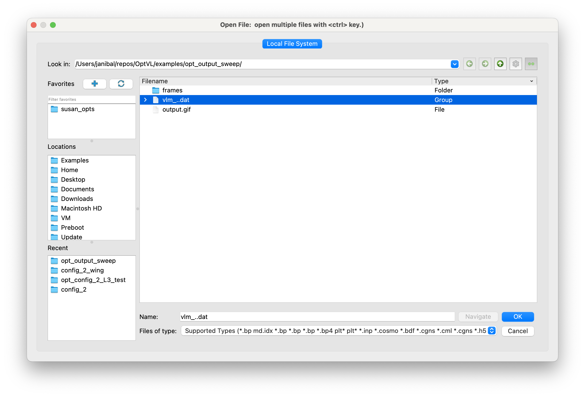
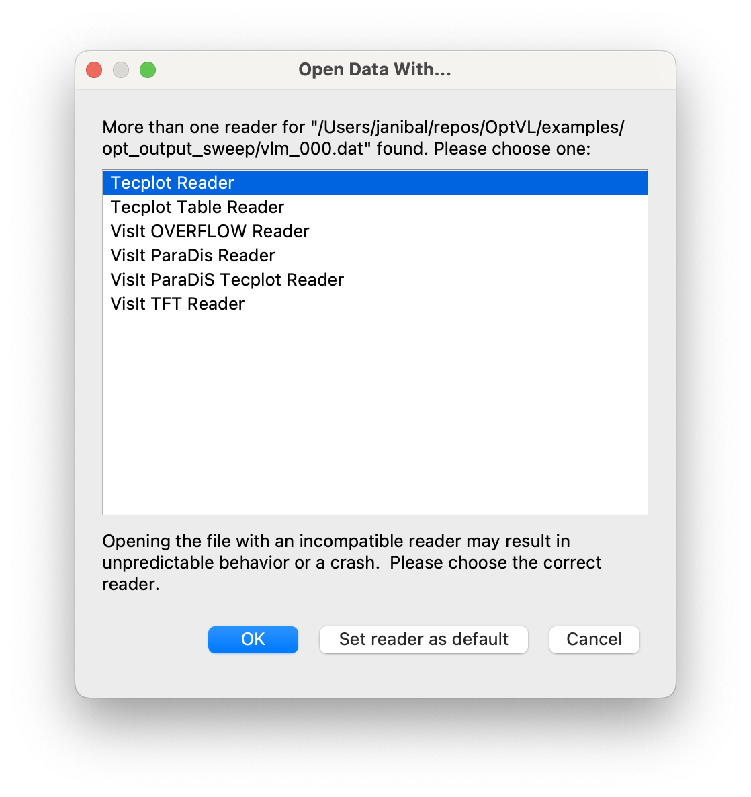
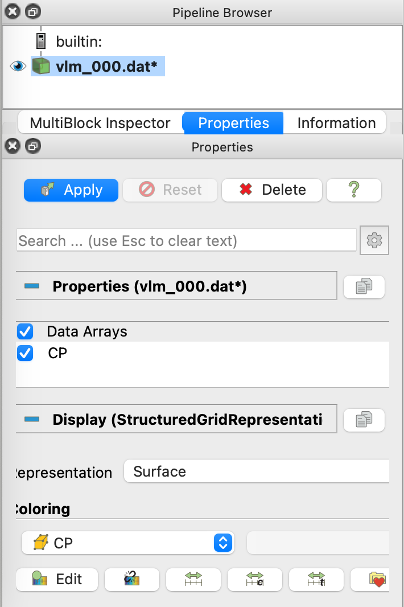
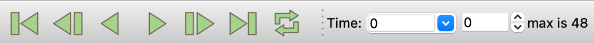
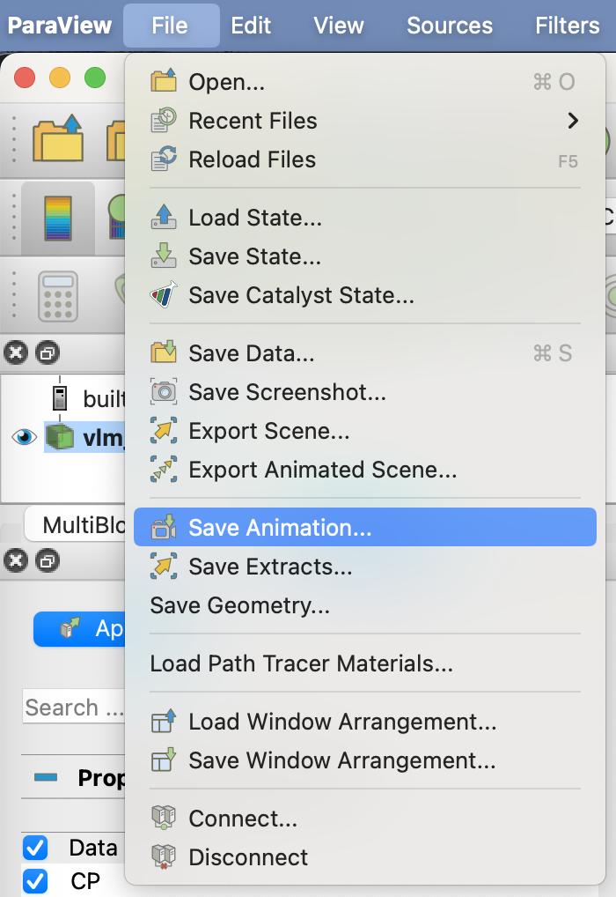
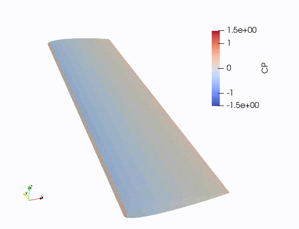

# How to make a movie

There are many methods to do this, the one that I cover here will use ParaView. 

## Getting the data files
The 0-th step to making a movie/animation is to save the data that you want to visualize. 
This data could come from a parameter sweep or optimization run for example. 
The data read in by TecPlot and ParaView can be output using `ovl_solver.write_tecplot()`. 
That is not a typo, ParaView can read in the TecPlot file format too, but unlike TecPlot is Free. 
To make your life much easier in ParaView you should name your files with numbered suffix like `f'wing_{idx_iter}'`. 
If you are using OptVL via the OpenMDAO group simply set the `write_grid` option to `True` when creating the group to write out these files, i.e. `OVLGroup(geom_file="rectangle.avl", write_grid=True)`.

## Load the data 
When importing data into ParaView if you named your files file_001, file_0002, ... you will see them displayed as a stack (file_001, file_0002, ...). 
Load the stack of data to bring all the iterations of your data into ParaView. 

While loading that data be sure that the TecPlot reader is used. 

## Setting up the view
At first you won't be able to see that data. You will need to confirm that you want to load in the Cp data by hitting 'apply' and then clicking the eye to see your surface. 

Setting the surface coloring to 'Cp' will show contours of 'Cp' on the surface. 

To set the contours to your liking you will want to adjust it with the contour control bar. 
To set the range manually you will need to click the icon with the 'C'.

If you loaded in the data as a stack you will be able to flip through it by stepping forward in time. 

## Exporting the data as a movie/animation.
The final step is to export the data as a movie or animation. 
From the file menu, simply select 'save animation'.

 

I had some trouble exporting the data as a .avi file from ParaView 12.0, but version 13.4 worked well. 
Following this process with the data from the planform optimization example, I get something like this. 

