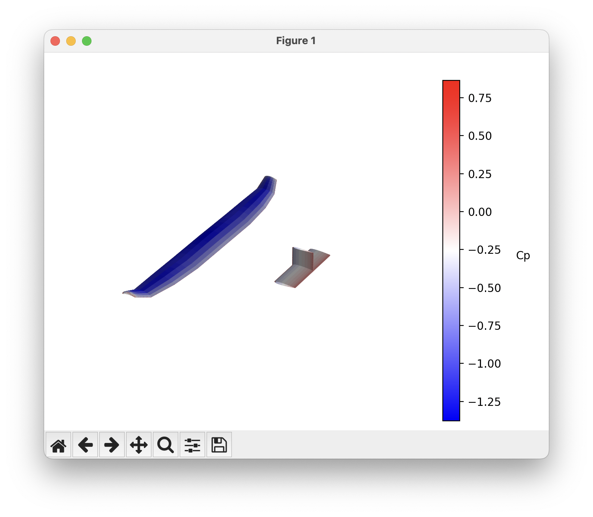
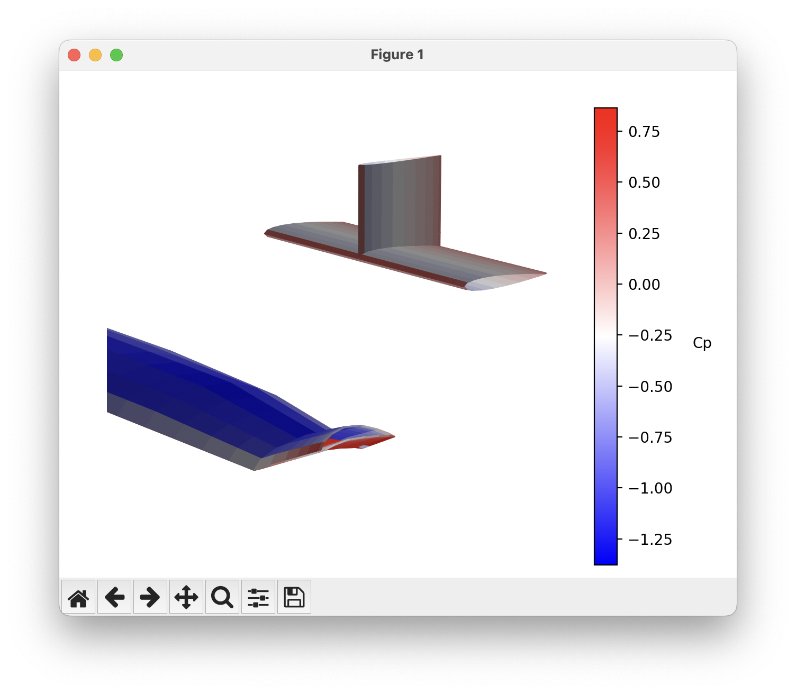

# Building a run script
Here we will go over the elements of setting up and running a basic analysis in OptVL in more detail. 
To see a complete example of a run script see the one in the [overview page](overview.md) or the [examples on GitHub]()


## Initializing and Setting up AVL Solver
To begin with `OptVL`, start by initializing the `OVLSolver` class:

```python
ovl = OVLSolver(geo_file="aircraft.avl")
```

Like AVL, you can also add a mass file as well. 

```python
ovl = OVLSolver(geo_file="aircraft.avl", mass_file="aircraft.mass")
```

## Setting variables and control deflections
After initializing, you can set up various constraints directly.
You can set `alpha`, `beta`, `roll rate`, `pitch rate`, and `yaw rate` as well as any control surface in this way. 

```python
ovl.set_variable("alpha", 0.00)
```
You can also set the deflection of any control surface for a run.
The control surfaces are specified using the names in the geometry file.
```python
ovl.set_control_deflection("Elevator", 0.00)
```

## Setting parameters
You can also set parameters of the run case. 
The list of parameters you can set are `CD0`, `bank`, `elevation`, `heading`, `Mach`, `velocity`, `density`, `grav.acc.`, `turn rad.`, `load fac.`, `X cg`, `Y cg`, `Z cg`, `mass`, `Ixx`, `Iyy`, `Izz`, `Ixy`, `Iyz`, `Izx`, `visc CL_a`, `visc CL_u`, `visc Cm_a`, `visc Cm_u`,
```python 
# set the flow parameters like mach numbers
ovl.set_parameter("Mach", 0.3)
```


## Setting constraints
You can also set a variable in order to meet a specific constraint value. 
The valid constraint options are `CL`, `CY`, `Cl`, `Cm`, `Cn`.
The roll moment coefficients have lower case letters just like in AVL.

!!! Warning
    Note the difference in capitalization between the coefficient of lift, CL, and the roll moment coefficient, `Cl`.

!!! Warning
    Be careful to state a constraint variable that is affected by the input. For example if you accidentally specify that the pitching moment should be trimmed by the rudder the analysis will not converge. 

```python
# set the Elevator to trim Cm to zero
ovl.set_constraint("alpha", "CL", 0.5)
# set the Elevator to trim Cm to zero
ovl.set_constraint("Elevator", "Cm", 0.00)
# set the Rudder to trim Cn to zero
ovl.set_constraint("Rudder", "Cn", 0.00)
```


## Running Analysis

Once you've set up the solver, running the analysis is straightforward:

```python
ovl.execute_run()
```

For a more detailed example and advanced use cases, see the analysis guide.

## Looking at Data
After executing the run, then you can extract various output data from the solver.
The methods for extracting data return a dictionary of data. 

To get things like CL, CD, CM, etc., use 
```python 
force_data = ovl.get_total_forces()
```
For stability derivatives such as `dCm/dAlpha` use
```python
stab_deriv = ovl.get_stab_derivs()
```
And finally for control surface derivatives like `dCm/dElevator` use
```python
consurf_derivs = ovl.get_control_stab_derivs()
```

## Running an Optimization 
See [optimization](optimization_overview.md)

## Visualization
The visualizations described in this section rely on the `matplotlib` package. 

### Looking at the geometry
To quickly look at your geometry you can use the
```python
ovl.plot_geom()
``` 
command, which will produce a figure that looks like this. 


### Cp plots 
To get a quick view of the coefficient of pressure on the surfaces of the aircraft you can use 
```python
ovl.plot_cp()
```
Which will produce a plot like this. 


You can rotate, zoom, and pan in the window to look at different parts for the aircraft.

