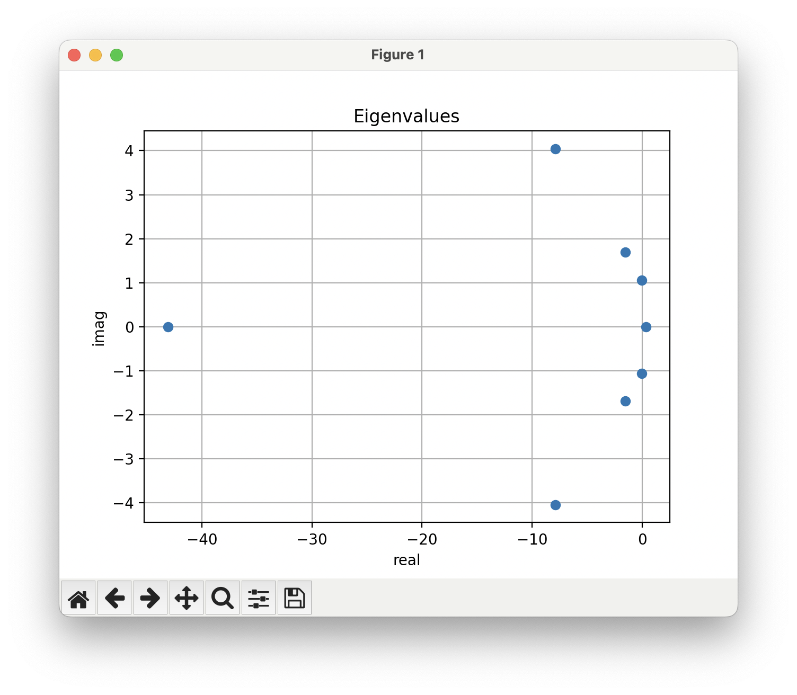

# Modal Analysis

You can also perform eigenvalue analysis of the aircraft to characterize its dynamic stability. 
Instead of calling `execute_run`, call `execute_eigen_mode_calc`.
To run this type of analysis the aircraft should be in trim, so here we determine the CL necessary for lift = weight. 
You must also set a velocity before the analysis with `ovl.set_parameter("velocity", <velocity>)`
You can retrieve the eigenvalues and vectors after the analysis with `get_eigenvalues` and `get_eigenvectors`. 

```python

```

The eigenvalues should look like this 

