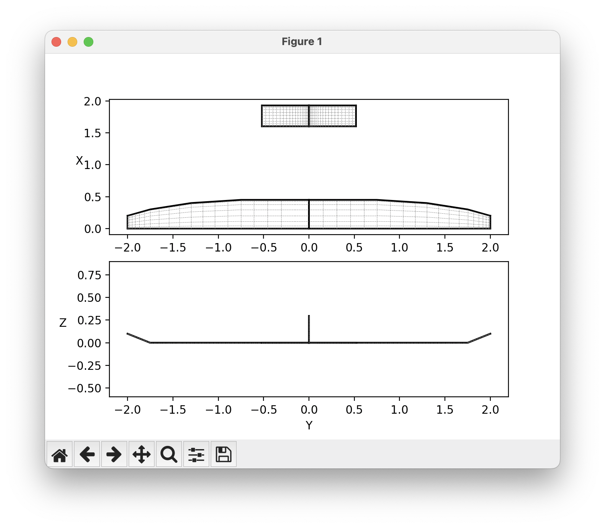

# Basic Usage Overview

`OptVL` offers a python API mirroring AVL's text interface.
The typical workflow involves loading a geometry file, adding constraints, and executing analysis runs.
In addition to this though, OptVL also offers unique optimization functionality. 


<!-- 
The commands from the oper and mode menus are available 


```
  C1  set level or banked  horizontal flight constraints
  C2  set steady pitch rate (looping) flight constraints
  M odify parameters                                    

 "#" select  run case          L ist defined run cases   
  +  add new run case          S ave run cases to file   
  -  delete  run case          F etch run cases from file
  N ame current run case       W rite forces to file     

 eX ecute run case             I nitialize variables     

  G eometry plot               T refftz Plane plot       

  ST  stability derivatives    FT  total   forces        
  SB  body-axis derivatives    FN  surface forces        
  RE  reference quantities     FS  strip   forces        
  DE  design changes           FE  element forces        
  O ptions                     FB  body forces           
                               HM  hinge moments         
                               VM  strip shear,moment    
  MRF  machine-readable format CPOM OML surface pressures
``` -->
# Overview of API
|action| avl oper command| OptVL api call|
|-----|--|--|
|setting the angle of attack|a a <angle>|ovl.set_constraint("alpha", <angle>)|
| set variable such that constraint = val | <variable> <constraint> <val> | ovl.set_constraint(<variable>, <val>, con_var=<constraint>) |
| set CL  constraint|  c1; c 1.3| ovl.set_trim_condition("CL", 1.3)|
| run an analysis | x | ovl.execute_run() |
| after an analysis | FT |  get_total_forces() |
| get strip force data | ST | get_strip_forces() |
| get shear mommen distribution | VM | get_strip_forces() |
| get control surfaces derivatives (e.g. dCL/dElevator)| ST | get_control_derivs |
| get stability derivatives | ST | get_stab_derivs()|
| get stability derivatives in the body axis| SB | - |
| get/set reference data | RE | get_reference_data/set_reference_data()|
| get/set  design variables specified in AVL file | DE | -|
| look at options?? | O | - |
| get surface forces | FN | get_surface_forces() |
| get force distribution on strips| FS| get_strip_forces() |
| get force distribution on elements | FE | - |
| get body forces| FB | -|
| get high moments| HM | get_hinge_moments() |


## Initializing and Setting up AVL Solver
To begin with `OptVL`, start by initializing the `AVLSolver` class:

```python
ovl = OVLSolver(geo_file="aircraft.avl")
```

Like AVL, you can also add a mass file as well. 

```python
ovl = OVLSolver(geo_file="aircraft.avl", mass_file="aircraft.mass")
```


## Constraints
After initializing, you can set up various constraints directly.
You can set `alpha`, `beta`, `roll rate`, `pitch rate`,and `yaw rate` as well any control surface in this way. 

```python
ovl.set_constraint("alpha", 0.00)
```

You can also set a variable in order to meet a specific constraint value. 
The valid constraint options are `CL`, `CY`, `Cl roll moment`, `Cm pitch moment`, `Cn yaw moment`.

!!! Warning
  Be careful to state a constraint variable, `con_var` that is effected by the input. For example if you accidentally specific that the pitching moment should be trimmed by the rudder the analysis will not converge. 

```python
# set the Elevator to trim Cm to zero
ovl.set_constraint("Elevator", 0.00, con_var="Cm pitch moment")
# set the Rudder to trim Cn to zero
ovl.set_constraint("Rudder", 0.00, con_var="Cn yaw moment")
```

You can also set parameters of the run case. 
The list of parameters you can set are `CD0`, `bank`, `elevation`, `heading`, `Mach`, `velocity`, `density`, `grav.acc.`, `turn rad.`, `load fac.`, `X cg`, `Y cg`, `Z cg`, `mass`, `Ixx`, `Iyy`, `Izz`, `Ixy`, `Iyz`, `Izx`, `visc CL_a`, `visc CL_u`, `visc CM_a`, `visc CM_u`,
```python 
# set the flow parameters like mach numbers
ovl.set_parameter("Mach", 0.3)
```

## Running Analysis

Once you've set up the solver, running the analysis is straightforward:

```python
ovl.execute_run()
```

For a more detailed example and advanced use cases, see the analysis guide.

## Running and Optimization 
See [[optimization]]

## Visualization
The visualizations described in this section rely on the `matplotlib` package. 

### Looking at the geometry
To quickly look at your geometry you can use 
```python
ovl.plot_geom()
``` 
command, which will produce a figure that looks like this. 



### Cp plots 
To get a quick view of the coefficient of pressure on the surfaces of the aircraft you can use 
```python
ovl.plot_cp()
```
Which will produce a plot like this. 


You can rotate, zoom, and pan in the window to look at different parts for the aircraft.


# Limitations
1. OptVL does not support multiple run cases
2. There is no single precision version of OptVL available for download
   - You could compile one yourself if you really need this
