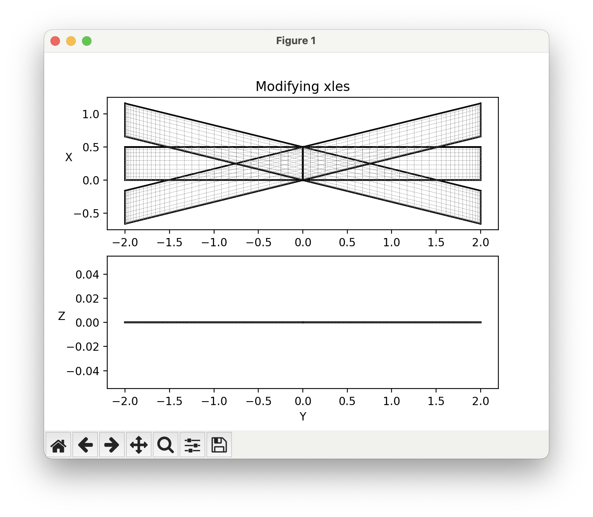
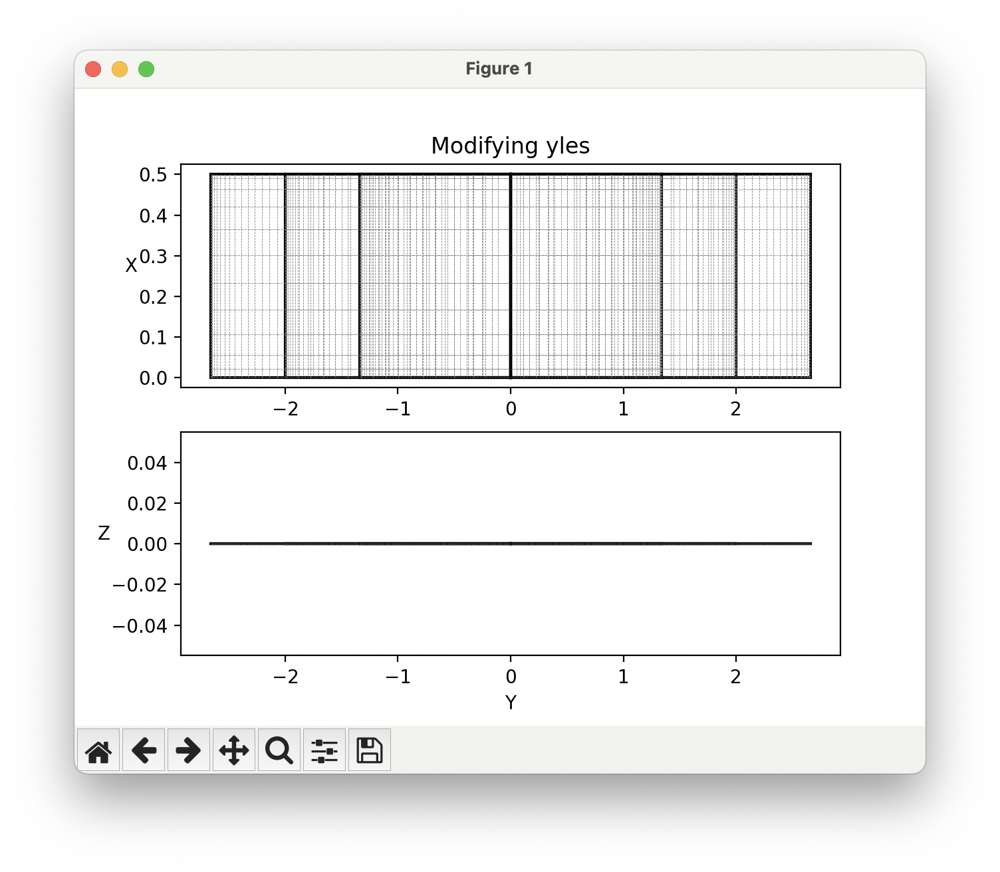
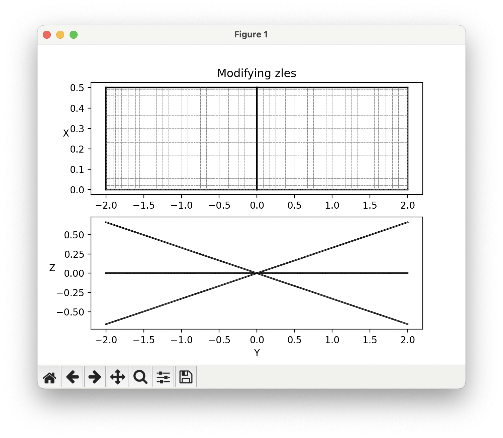

# Modifying Geometry for Parameter Sweeps

OptVL not only offers aerodynamic analysis capabilities but also provides tools to access and modify geometric parameters of your aircraft models.
This page shows how users can retrieve and set geometry parameters for parameter sweeps.


## Getting geometry parameters

To retrieve surface parameters from your AVL model, use the `get_surface_params` method.
By default, this method only returns data about the geometry of the surface, but information about the paneling and control surfaces can also be included by passing the corresponding flags, like so: 
```python
surf_data = ovl.get_surface_params(
    include_geom=True,
    include_paneling=True,
    include_con_surf=True
)
```
The data from `get_surface_params` come directly from the geometry file used by AVL.
See the [AVL user guide](https://web.mit.edu/drela/Public/web/avl/avl_doc.txt) for more information about all the possible variables.
If you only want to get a specific design variable, then you can instead use:
```python
ovl.get_surface_param( <surf_name>, <param>)
```
For most use cases, you will only need to interact with the geometric variables below. 

| Variable    | Description                       |
|-------------|-----------------------------------|
| scale       | Scale factor.                     |
| translate   | Translation vector.               |
| angle       | Surface angle.                    |
| aincs       | Array of angle increments.        |
| chords      | Array of chord lengths.           |
| xyzles      | Array of leading edge coordinates.|


## Setting geometry parameters

To apply geometry changes to the OVLSolver object, use the `set_surface_params` method.
```python
ovl_solver.set_surface_params(data)
```
This method sets the surface parameters of the AVL model based on the provided dictionary data.
The data passed to this method must be a dictionary of surface names whose values are a dictionary of surface and section keywords.
An example of such a dictionary is:
```python
data = {
    'Wing': {
        'angle': 3.5,  # a surface keyword example
        "chords": np.array([0.5, 0.4, 0.3, 0.2, 0.1]) #section keyword example
    }
}
```
The structure of the data dictionary must be the same as that returned by the `get_surface_params` method, so I recommend calling `get_surface_params` and looking at the output if you get confused:
Similar to the getting methods, you can also set values one at a time like so:
```python
ovl.set_surface_param( <surf_name>, <param>, <value>)
```

## Example modifying y scale
To increase the span of our wing, we can stretch it in the y direction by adjusting the y scale. 

```python 

```


## Example modifying the leading edge coordinates
The example below modifies the array of leading edge points to modify the planform. 

```python 

```

Running the script generates the following plots showing the modifications to the geometry.





