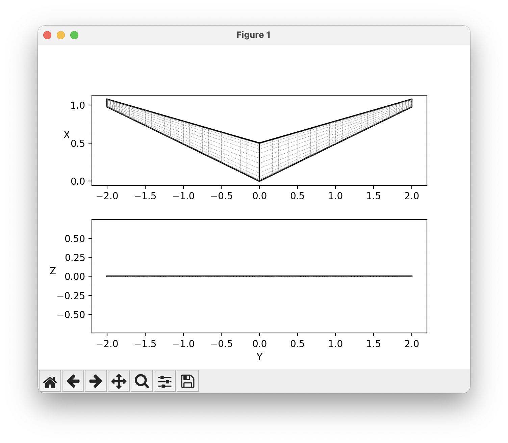

# Planform optimization

This is a considerably more advanced tutorial that aims to represent a more realistic optimization problem. 
We are going to optimize the planform of a flying wing for maximum glide duration.
In this example, we are going to walk through the planform optimization starting from a rectangular wing. 
We are going to modify the sweep of the wing with a custom parameterization that takes in the sweep design variable and sets the y coordinates of the leading edge accordingly. 
We add additional OpenMDAO components to add this additional functionality to our optimization. 
This is the power of OpenMDAO!
<!-- Just add another component and OpenMDAO will figure out how to pass around the right derivative information. -->

## Custom parameterization
AVL defines the geometry at each section; however, wing planforms are generally defined with parameters that affect all sections such as sweep and taper ratio. 
To modify the geometry according to traditional planform variables we need to define a custom geometry component. 
The OpenMDAO Component below takes in the root chord, quarter chord sweep angle, and taper ratio and produces the sectional geometry needed by OptVL:
```python

```

However, the component also needs the baseline section y coordinates.
To supply this value we add a mesh component upstream of the geometry parameterization. 
If the parameterization did not rely on these baseline values this would not be necessary.
The N2 diagram below shows how by placing a mesh component upstream of the geometry component, we can use the baseline values in our parameterization. 


## Mass properties
When modifying the planform, it is important to consider how the center of gravity and overall weight will be affected by the modification. 
To incorporate these effects into the model, a basic mass properties component recomputes these properties based on the planform. 
This component assumes that the aircraft is cut from a material of uniform density (such as foam) to make the calculation easier. 
```python

```

## Custom Objective
Instead of minimizing drag like the prior optimization examples, here I use the outputs of OptVL to compute the glide duration.
This is done with another OpenMDAO component that uses the mass properties and CL and CD of the candidate design. 
The glide duration is calculated assuming a steady glide from a fixed height (100 meters).

```python

```

## Example Script
Combining all these components into the OpenMDAO model we get the following script. 

```python

```

## Results

The optimized design has a glide duration of over 1400 seconds.
We can plot the objective function over the iterations using OpenMDAO's `CaseReader` class, using the recorder we made. 
Additionally, we can load in the last `.avl` file written during the optimization to view the geometry of the optimized design. 
```python

```

The objective function quickly rises to about 1400 seconds and then levels off. 


However, if we zoom in we can see that some slight improvements are still being made to the design over the final iterations


From the geometry we can see that the aspect ratio of the wing has increased dramatically and now has a sweep.



Looking at the twist and chord distribution, we can see a linear chord distribution because of the taper ratio and the wash-out in the sweep. 
The lift distribution does not look elliptical, which makes sense, as maximizing glide duration is not equivalent to minimizing drag. 


