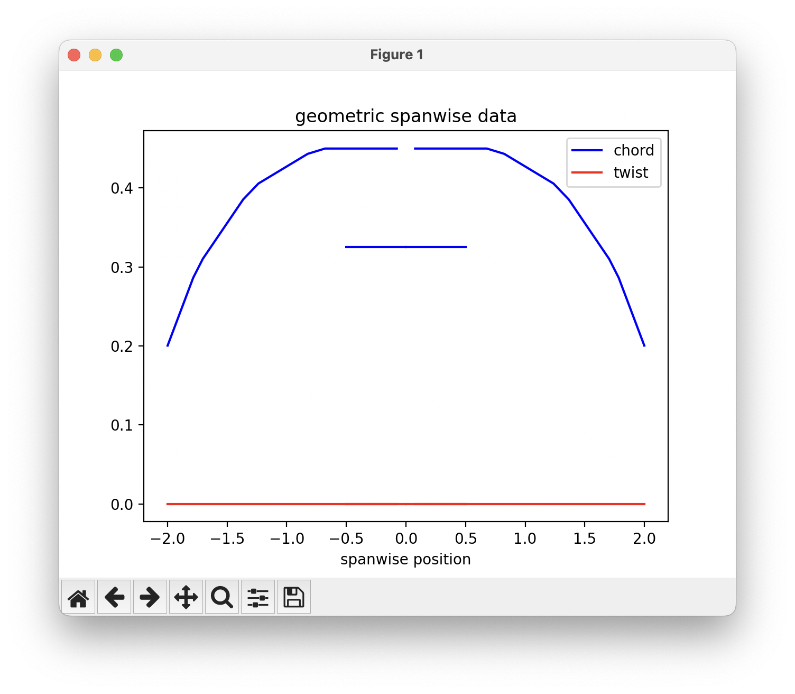
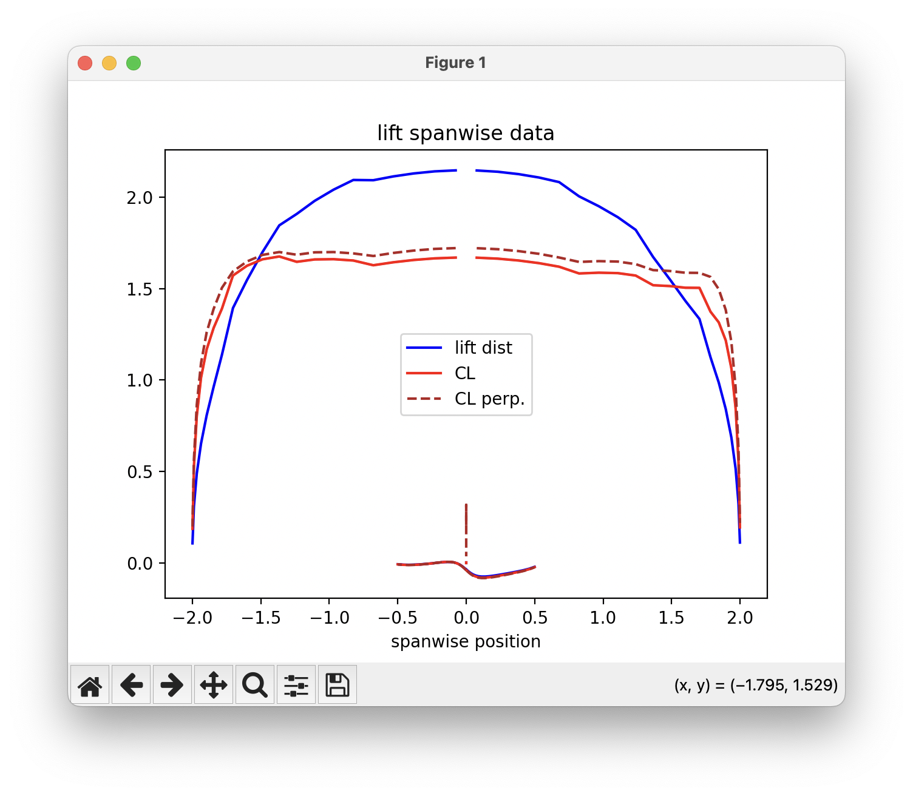
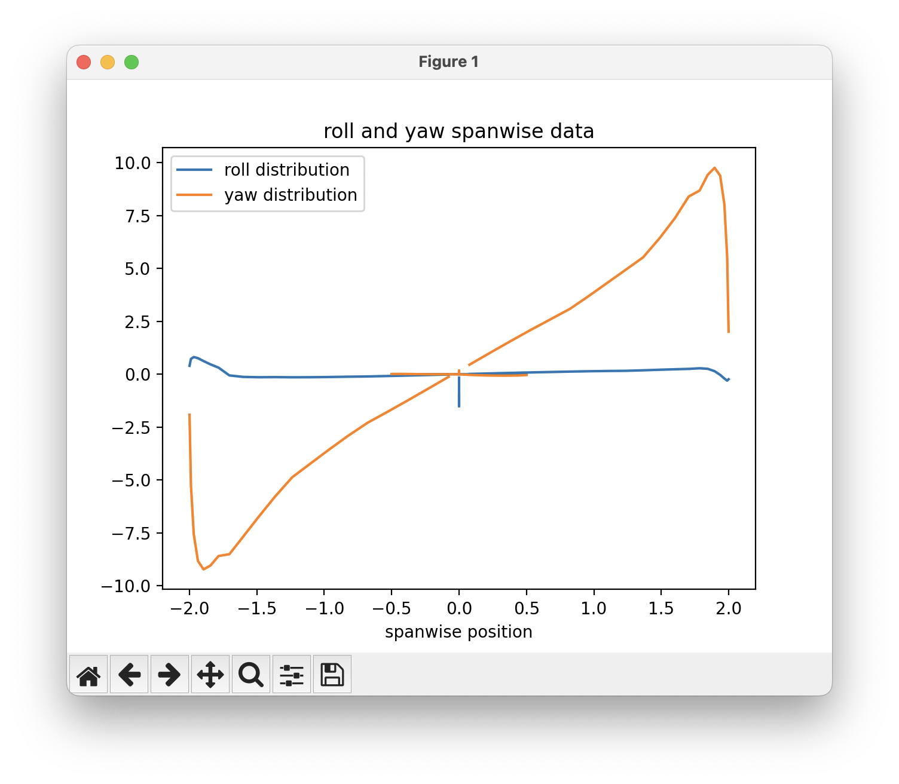

# Sectional Data

Like AVL, OptVL can also plot data about each chordwise section. 
This data is useful for visualizing the force distribution along the wing among other things. 
In contrast to AVL's integrated plotter, we return the data and allow you to plot it anyway you wish.
In this demo we use `matplotlib` as it by far the most common package for plotting in Python. 

## Plotting the data 
To get the data, just call the `ovl.get_strip_forces()` method.
The data is organized by surface and each surface has sectional geometric and force/moment data.
```python

```
Running the snippet above produces the list of data available for each surface: 
```
dict_keys(['chord', 'width', 'X LE', 'Y LE', 'Z LE', 'twist', 'CL', 'CD', 'CDv', 'downwash', 'CX', 'CY', 'CZ', 'CM', 'CN', 'CR', 'CL strip', 'CD strip', 'CF strip', 'CM strip', 'CL perp', 'CM c/4', 'CM LE', 'spanloading', 'lift dist', 'drag dist'])
```

Some data is about the geometry of the chordwise sections such as chord and twist. 
The twist of our baseline design is all zero, but we have some variation in the chord that you can see on the plot: 


One of the most useful things to look at is how the lift is distributed over the wing at our analysis condition. 
Just like AVL, you can plot the CL and the CL perpendicular to the wing of the aircraft.
The lift distribution is found by multiplying the CL at each section by the chord/cref.


You can also look at how each section contributes to the overall roll and yaw moment coefficients. 
The roll distribution is the `CR*chord^2/cref^2` and the yaw distribution is `CN*chord^2/(cref*bref)`.


## Example
The example script below can be used to generate these plots for the example aircraft. 


```python 

```

