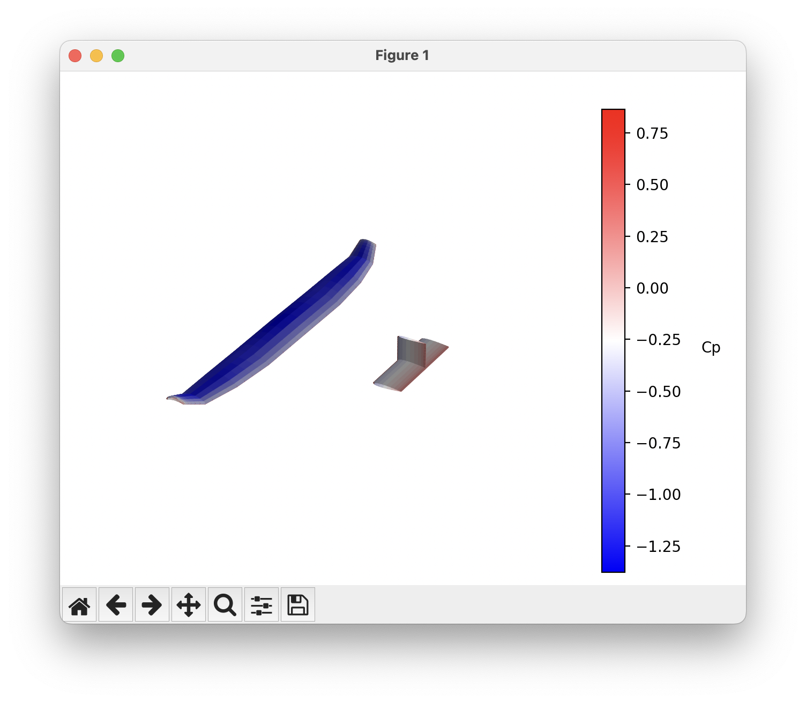
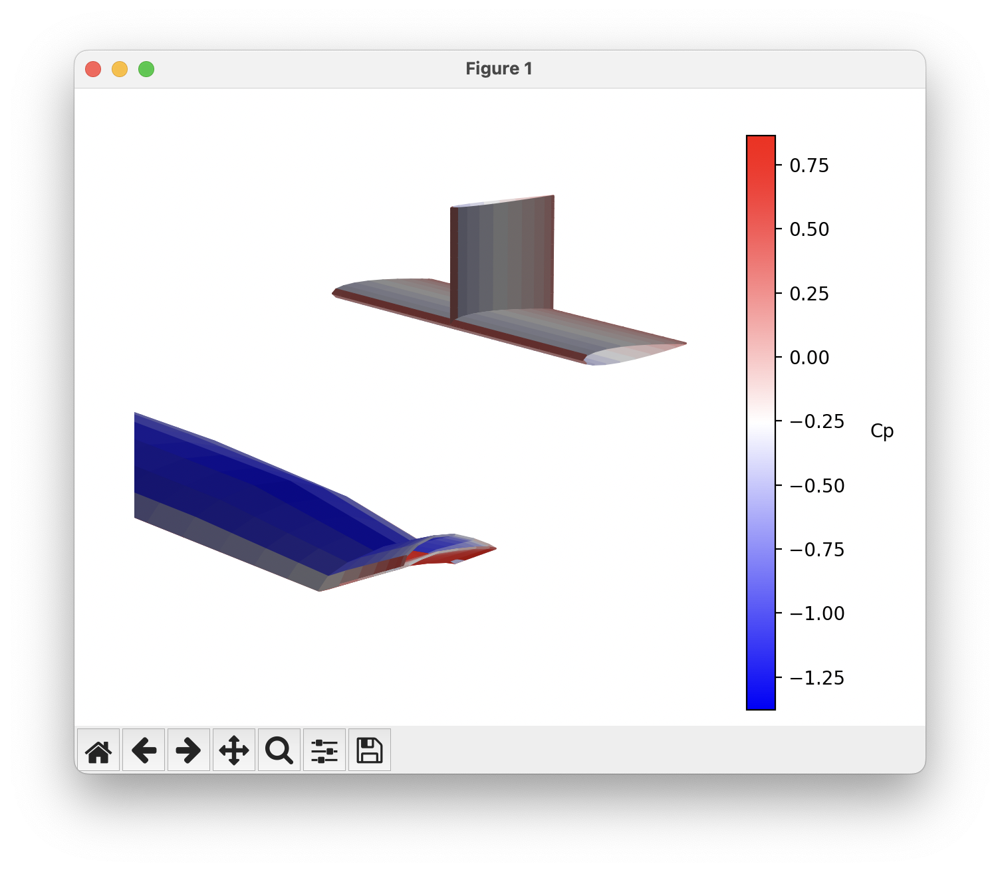

# Visualization


## With Matplotlib/Python
The visualizations described in this section rely on the `matplotlib` Python package, but no external tools. 

### Looking at the geometry
To quickly look at your geometry you can use the
```python
ovl.plot_geom()
``` 
command, which will produce a figure that looks like this: 


### Cp plots 
To get a quick view of the coefficient of pressure on the surfaces of the aircraft you can use 
```python
ovl.plot_cp()
```
Which will produce a plot like this: 


You can rotate, zoom, and pan in the window to look at different parts for the aircraft.


## ParaView or Tecplot
This section describes how to produce data that can be used with either Tecplot or ParaView.

To generate a Tecplot ASCII file (which can be read by both Tecplot and ParaView). 
After an analysis, use the command: 
```python
ovl_solver.write_tecplot('test')
```
This command will write a file called `test.dat`.

### Tecplot 360

If you load the file with Tecplot 360 it will automatically be detected as a Tecplot ASCII file and will be loaded accordingly. 
By default, Tecplot tends to plot the data with a 2D Cartesian plot, but you will have to switch it to 3D Cartesian to see the full geometry. 


You can also plot the mesh and the coefficient of pressure on the surface: 


When writing out the Tecplot file you can also specify a solution time with the optional keyword argument. 
This makes it easier to flip through different data files in Tecplot but makes the output incompatible with ParaView.
```python 
ovl_solver.write_tecplot('test', solution_time=1)
```

## ParaView

When loading your data into ParaView, be sure to use the Tecplot data loader. 


With the data loaded you can view the 3D shape, Coefficient of Pressure, and mesh just like with Tecplot. 


ParaView nicely stacks up files of the same name but with different numeric suffixes and loads them into different timesteps. 
So if you want to easily view the results of an optimization or parameter sweep, name your output files with the same name but a different number for the suffix. 