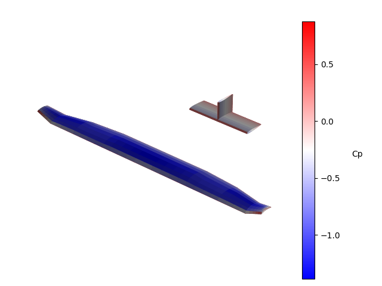
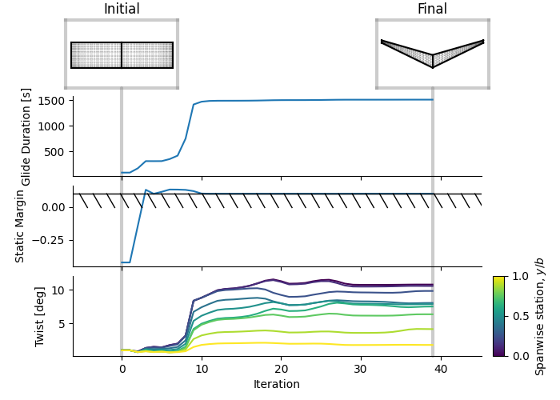

---
title: 'OptVL: AVL extended for Python scripting and optimization'
tags:
  - Python
  - aerodynamics
  - optimization
  - mdo
  - aircraft design
authors:
  - name: Joshua L. Anibal
    orcid: 0000-0002-7795-2523
    corresponding: true
    affiliation: 1
  - name: Safa A. Bakhshi
    # TODO-SB: add your orcid
    affiliation: 1
  - name: Joaquim R. R. A. Martins
    orcid: 0000-0003-2143-1478
    affiliation: 1
affiliations:
 - name: Department of Aerospace Engineering, University of Michigan
   index: 1
date: July 24, 2026
bibliography: paper.bib
--- 

# Summary
Tools for aerodynamic performance assessment are critical for aircraft design.
The estimates generated by these tools are the basis of configuration selection, sizing, and trade studies. 

Fundamentally OptVL is an aircraft aerodynamics assessment tool geared towards conceptual designers, multidisciplinary design optimization (MDO) practitioners, and students.
OptVL is based on the popular Athena Vortex Lattice (AVL) code [@DrelaYoungrenAVL], and thus uses a discrete representation of the vorticity distribution over a lifting surface to model its influence on the airflow.
For a given aircraft design and operating condition, it provides calculations of the loads (lift, drag, etc.), stability derivatives (how perturbations to the operating condition affect the loads), and design sensitivities (how changing geometric and aerodynamic parameters would affect the performance).
The design sensitivities are computed exactly and efficiently through the use of adjoint and direct methods, which combine partial derivatives analytically to compute the total derivatives of outputs that implicitly depend on inputs.
Consequently, OptVL aims to not only make analysis easier for early aircraft design, but also optimization as well.

<!-- AVL is an industry standard code that has been tested over the course of decades and is frequently taught in aerospace curriculums.
OptVL is a modified and extended version of Mark Drela and Harold Youngren's famous Athena Vortex Lattice (AVL) code. -->
<!-- OptVL's key features are -->

<!-- - Python wrapper and AVL source modifications to easily conduct large parameter sweeps from an existing AVL geometry file or include a vortex lattice method in a larger model.
- Total derivatives of forces, control surface derivatives, and stability derivatives with respect to geometric and aerodynamic variables for use within gradient-based optimization.
- Post-processing directly through Python or Paraview and Tecplot for flexibility. 
- Specify aircraft geometry via a Python dictionary rather than a geometry file.
- Set the geometry via a mesh of points rather than through the section-based  geometry engine. -->

<!-- How does this section and the preceeding section connect?
- I need to describe the problem I am trying to solve
- What is the current state of solutions, and why they do not resolve the problem
- How OptVL addresses the shortcomming -->

# Statement of need
Although vortex lattice method (VLM) codes are limited in fidelity and applicability, they provide reasonable aerodynamic estimates quickly and only require a planform representation of the geometry.
Getting performance numbers quickly helps aircraft designers consider many concepts and assess how modifying high-level aircraft parameters will affect the design.
As a result, these VLM codes have been used in aeronautical engineering for decades.

However, the needs of aircraft designers have evolved over the decades.
MDO is gaining traction within the industry as a complement to traditional design approaches.
By integrating models of many subsystems together, engineers can quantitatively assess the impact of design decisions on interconnected systems.
Additionally, by creating a multidisciplinary model, engineers can use numerical optimization to automatically vary the design parameters for design refinement.
Higher-level languages, like Python, offer a way to "glue" disciplinary models together, but also require an interface.
Unfortunately, as the number of design variables grows, the cost of gradient-free optimizers grows quickly (often quadratically) [@Martins2022].
Fortunately, gradient-based optimizers offer a much more efficient alternative that scales well with the number of design variables.
Despite the widespread use of VLM codes, there still remains a need for an open-source VLM that is easy for the average aerospace engineer to set up with complete support for scripting and gradient-based optimization.

# State of the field
Currently, many VLM solvers exist and are used by aerospace engineers.

Despite being originally written in the late 70s [@Miranda1977], Vorlax is still updated and used by researchers today [@Souders2021]. 
Although Vorlax was originally released as source code, it has been developed under a closed-source model at various companies and universities.
The publicly accessible versions of Vorlax lack scripting integration and sensitivities for gradient-based design.

<!-- - tornado
    - matlab based
    - Doesn't have sensitives -->
Tornado [@Melin2000] is a VLM solver built in MATLAB.
Although the source is freely available, the development is closed.
The integration into MATLAB makes scripting easy, but it does not have support for gradient-based design.

VSPAERO is an open-source vortex lattice and panel code with many features tightly integrated into the open Vehicle Sketch Pad (OpenVSP) geometry tool [@McDonald2022].
It is possible to use its Python API to include OpenVSP and VSPAERO in a larger model.
VSPAERO recently added design sensitivities via a handwritten adjoint method that efficiently computes sensitivities of loads.
When combined with finite differences across the geometric parameterization, one can compute the sensitivities with respect to the design parameters.
However, as of version 3.51.2, the stability derivatives required for stability constrained optimization are not themselves differentiated with respect to aerodynamic and geometric parameters.

OpenAeroStruct [@Jasa2018a] is an open-source Python-based aerostructural analysis and optimization tool built with the OpenMDAO framework [@Gray2019a].
OpenMDAO makes it possible to incorporate OpenAeroStruct into a Python script and use it in an optimization, but creates a steeper learning curve for people unfamiliar with OpenMDAO.
It couples a vortex-lattice method with a structural beam model.
It is fully capable of running and providing sensitivities for aero-only analysis.
 <!-- did not have all the outputs needed for a practical optimization. Stability derivatives -->
Unlike AVL or OpenVSP, models are formed through manipulation of the mesh rather than section-based geometry definition.
Like VSPAERO, as of version 2.12.0 it does not offer sensitivities of aerodynamic stability derivatives, making it more difficult to ensure the resulting design is statically stable.

The most prolific VLM solver in the aeronautics field is Athena Vortex Lattice (AVL) [@DrelaYoungrenAVL]. 
Users operate AVL by navigating a text interface of settings and parameters via manual text input.
Despite its simplistic interface, many aerospace engineers still use AVL because of its heritage and rich set of features.
    <!-- - They already had AVL geometry files  -->
    <!-- - most were using AVL with custom wrappers that drove AVL -->
To add a layer of automation to AVL, many Python wrappers of AVL pipe in the commands required to set up and run an analysis through its text interface and parse the output files generated to return the aerodynamic data.
<!-- -PyAVL (not to be confused with pyAVL which was the precursor to OptVL) -->
However, the text input and output methods of traditional AVL wrappers have limitations.
First, AVL does not allow the user to read and write all data via its text interface.  
This makes certain forms of geometry manipulation difficult or impossible and prevents the user from setting the mesh directly.
Furthermore, the text wrapping method requires users to supply their own compiled AVL executable with its dependent libraries preinstalled.
This can be a non-negligible hurdle as most users of the software are primarily aerospace engineers with little computer science background. 
In particular, installing X11 (Linux) or XQuartz (macOS) is consistently a stumbling block for students first learning AVL.
Additionally, AVL does not compute the sensitivities required to integrate it into larger gradient-based design frameworks.
Only sensitivities of the loads with respect to the twist of wing sections are displayed in AVL.
AVL is missing sensitivity analysis for important wing shape design variables such as the chord distribution and XYZ position of the sections defining the shape.
<!-- Finally, The postprocessing of AVL is somewhat limited. 
AVL's IO of the surface data is restricted to an AVL-specific format and the output of other data is restricted to the predefined plots of data. -->
Finally, AVL is distributed under the GPL open-source license, but is closed development, making it difficult to significantly modify AVL itself to address these shortcomings.
<!-- Furthermore, when I started on OptVL I believed development of AVL had stopped since the developer did not publish any new releases between 2014 and 2021 -->
<!-- Modifications to the source are this happening, but are limited to small set of original developers. -->

<!-- - AVL outputs qualities in limited precision (AVL was recently modified to allow the user to dump all digits)
- Those that wanted the latest version on some systems had to compile it themselves -->

<!-- OptVL came about when I could not find a tool to address my needs for aircraft design projects.  -->
OptVL exists to make it seamless to integrate AVL into parameter sweeps and gradient-based optimization loops. 
Furthermore, it exists as an open-development project to centralize access to development while inheriting AVL's GPL open-source license.
In addition to maintaining AVL's validated aerodynamics model, OptVL has

1. A Python interface with unified memory that allows one to get and set values at the Fortran level directly.
2. Modes of input to specify a geometry without a file and set aerodynamic meshes directly.
    <!-- - ** is this true? We may need to add the body force and section sensitives ** -->
3. Total sensitivities of all outputs with respect to all inputs in both forward and reverse mode.
4. Python wheels for all major operating systems distributed on PyPI, greatly simplifying distribution.
5. IO of aerodynamic surface data in a format readable by industry-standard postprocessing tools (Tecplot, ParaView).

# Software design
The design philosophy of OptVL is centered around keeping the code easy to use and understand for aerospace engineers.
    <!-- - The AVL interface was well-thought-out to begin with. -->
<!-- We wanted to use AVL because of its status in the aerospace industry as the de facto VLM model with decades of validation. -->
As a result, OptVL's API was constructed to be similar to that of AVL to make the user transition frictionless.
However, unlike AVL, which uses a nested set of menus, OptVL exposes functionality through the methods of the `OVLSolver` class, which also holds the state information for the aerodynamic simulation.
Again to keep the level of programming knowledge to a minimum, all the return types from the API are native Python types or NumPy arrays [@harris2020].
By returning the data as NumPy arrays and supplying functions for adding data to Matplotlib [@Hunter2007] frames, a user has a lot more flexibility when deciding how to visualize the results.
An example of a Matplotlib visualization of the coefficient of pressure on the surface of the wing and tail is shown in \autoref{fig:cp}.

The Python layer, `OVLSolver`, wraps the underlying Fortran code.
F2PY [@Peterson2009] is the backbone of the integration between the Python and Fortran layers. 
Everything that the user interacts with is from the Python API layer which wraps the rougher Fortran level.
The F2PY wrapper allows the Python wrapper to read and write to the memory of the Fortran layer and call subroutines.
This approach was featured in our earlier package, pyAVL (`pyavl-wrapper` on PyPI), which was renamed OptVL to avoid confusion with unrelated projects of a similar name and emphasize the support for optimization.

At the Fortran level, geometry subroutines were heavily modified to provide the interface necessary to update the geometry or set the mesh data directly.
We expanded the original Fortran COMMON BLOCK memory layout since it gives the Python level complete access to read and write the entire state of the Fortran level.
While expanding on AVL it was deemed critical to maintain the core vortex lattice model physics of AVL, so users do not need to verify a new tool.
Tests in the continuous integration test suite verify that all available outputs from AVL match those from OptVL.

The strategy for creating the adjoint-based sensitivity routines is based on the work of @Kenway2019a.
The main benefit of the adjoint approach is that the cost for computing the derivatives needed by a gradient-based optimizer is independent of the number of design variables [@Martins2022].
This makes it a good fit for engineering design problems where the number of design variables tends to be orders of magnitude greater than the number of functions of interest.
<!-- This required adding routines to explicitly compute a residual for a circulation vector. -->
We use the source-transformation automatic differentiation (AD) tool TAPENADE [@hascoet2013] to create routines for the partial derivatives of the residual and all the outputs with respect to the input geometric, aerodynamic, residual, and state variables.
Each of these partial derivative routines is tested against finite differences to ensure they are accurate and bug-free. 
These partial derivatives generated by AD are incorporated into handwritten routines that solve the adjoint system and compute the total derivatives. 
This is important, as one can make simplifications rather than just blindly applying AD to everything.
For example, to compute the distribution of circulation for tangent flow along the surface, the code uses an LU factorization to solve the dense linear system.
It is much more efficient to perform transposed solves with these LU factors rather than differentiating the factorization process itself with AD. 

To integrate OptVL into an optimization loop a user can create objective and constraint functions that use `OVLSolver` directly in a SciPy [@Virtanen2020] script as shown in the examples [^1]. 
We also provide an OpenMDAO component that makes it easy to include OptVL as a component of a larger engineering model.
This is important as optimization is best done explicitly accounting for the impact across many disciplines to avoid unwanted specialization for one discipline at the expense of another, particularly at the conceptual design phase.
\autoref{fig:opt} shows an optimization problem from the documented examples that highlights how to include OptVL in a larger OpenMDAO model. 
In the optimization problem we are trying to maximize the glide time for a foam aircraft dropped from 100 m while making sure it remains aerodynamically balanced and stable.
The constraint on the stability, quantified here as static margin, is possible with sensitives of the aerodynamic stability derivatives and is necessary for a practical design.

[^1]: https://github.com/joanibal/OptVL/blob/main/examples/run_opt_scipy.py

<!-- ## CI/CD -->
As part of the effort to make OptVL easy to use we invested time to create and test Python wheels that could be pip installed across major platforms: macOS arm64, Windows x86 and arm64, Linux x86.
This significantly lowers the barrier to use the software since the user no longer has to know how to compile the code on their computer.
Although AVL ships single-precision binaries, we decided to focus on double precision when compiling OptVL because the extra precision tends to be useful in an optimization context.
The extra precision resolves smaller differences in outputs, allowing the optimizer to progress through flatter regions of the design space.
<!-- - finite difference precision tends to fall off like sqrt(function accuracy) -->

<!-- - cibuildwheel make this process easier and much of the engineering error was trying to get the compilers to work with large common blocks of F77
- We dropped support for macOS x86 and Linux arm64 since we imagined our target user, a graduate student or researcher in aerospace engineering, would be unlikely to use these platforms. -->

# Research impact statement
<!-- The evidence should be compelling and specific, not aspirational. Evidence of...
- Realized impact (publications, external use, integrations)
- credible near-term significance (benchmarks, reproducible materials, community-readiness signals). -->

Aircraft designers have already started to use OptVL as part of their research.
<!-- Simon Heer -->
In his Master's thesis, @Heer2025 used OptVL for the analysis and design optimization of a conceptual morphing wing UAV design across a range of lift coefficient targets.
<!-- Tiwari flying V -->
Furthermore, other researchers have used OptVL when optimizing control surface sizes on a novel "flying V" aircraft [@Twari2025].
<!-- TODO-SB: edit the description of your paper -->
After adding the ability to set OptVL meshes point by point rather than through a geometric definition, @Bakhshi2026 used OptVL in the context of aerostructural optimization of a <>.

In addition to academic use, OptVL has also been used by engineers in industry. 
An aircraft designer at a UAV manufacturer has contributed to the code base, and an author was invited to present OptVL to engineers at an eVTOL developer evaluating new aircraft concepts.

<!-- - Safa'd ICAS paper

Industrial use
email exchanges
- Use by archer
    - gave an in person presentation
- Daniel from a UAV company
- KIM YEON SEOK?

- John Yost in Germany 

Researcher using OptVL now
- Pablo Norczyk Simon
- Nils BARNER | PhD Student | Master of Research -->

# AI usage disclosure
<!-- Transparent disclosure of any use of generative AI in the software creation, documentation, or paper authoring. If no AI tools were used, state this explicitly. If AI tools were used, describe how they were used and how the quality and correctness of AI-generated content was verified. -->
Generative AI tools were used in the following ways when developing the software. 
Google Gemini via Jules was used to correct spelling and grammar in documentation and code comments.
Small features, like adding body visualization based on existing surface visualization, were generated by Anthropic's Claude and reviewed and modified by the authors.
Additionally, a variety of LLM chat tools were used frequently to understand compiler and runtime errors and create helper utilities to manage the common block variables.
Finally, Claude was also used to provide editorial feedback on a draft of this paper.

<!-- - Claude Opus 4.6-4.7
    - Used to interpret causes of LLVM Flang compiler errors when working on Windows Arm64 build
    - used to create a Python help script to create a set of AD seed variables used to reduce the size of the AD seed common block variables
    - Used to generate development help scripts to parse and the variables in the common block and estimate the total static memory allocation
    - Used to add `add_body_plot` visualization method based on the existing `add_mesh_plot` method
- chatGPT 4
    - used interactively to interpret compiler errors when initially setting up Python wheel CI pipelines -->